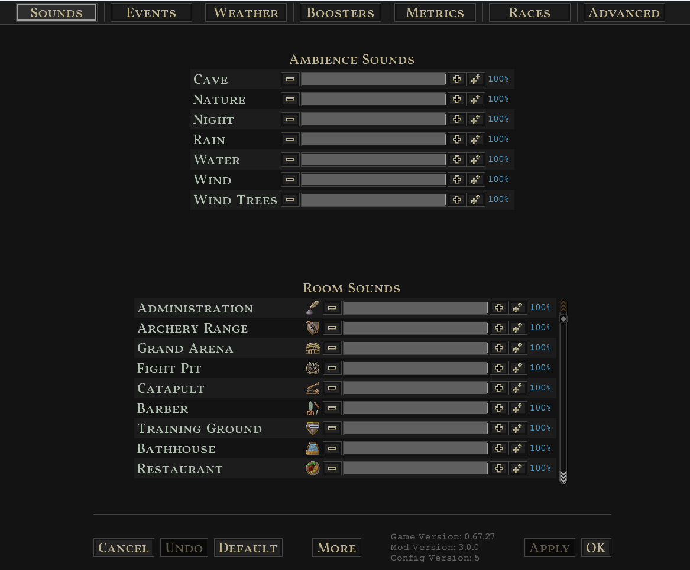
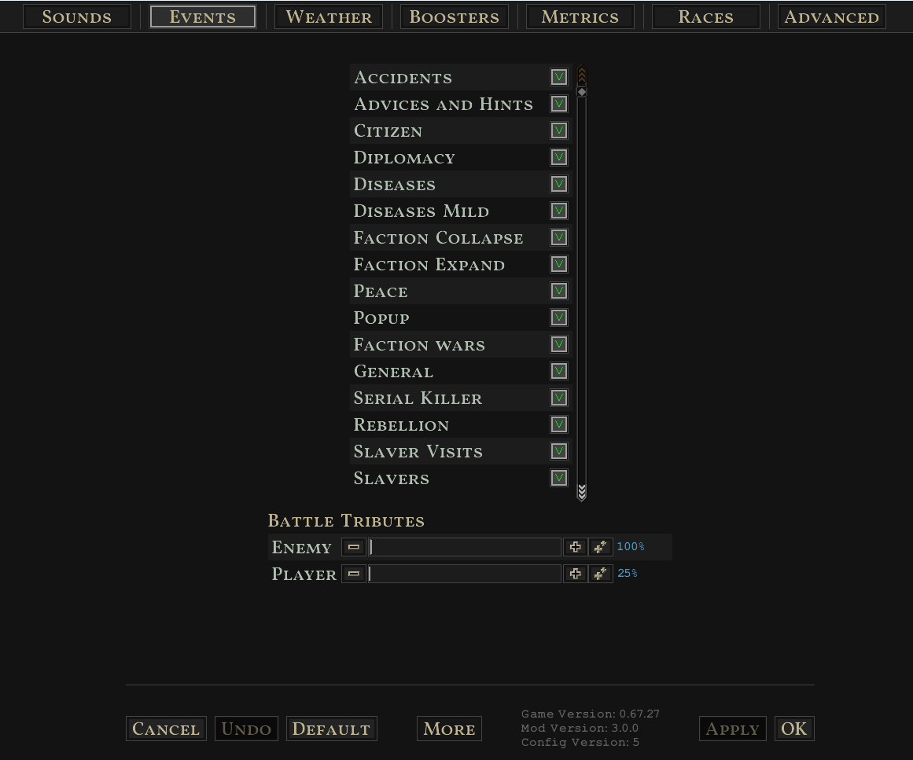
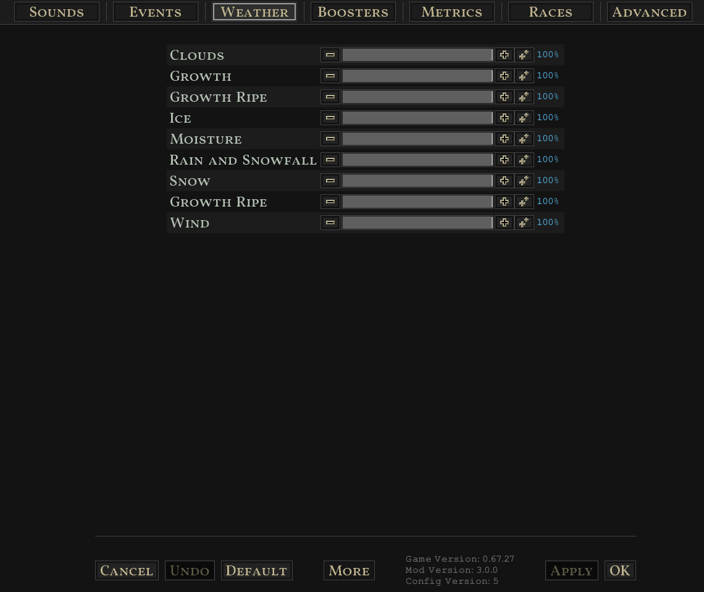
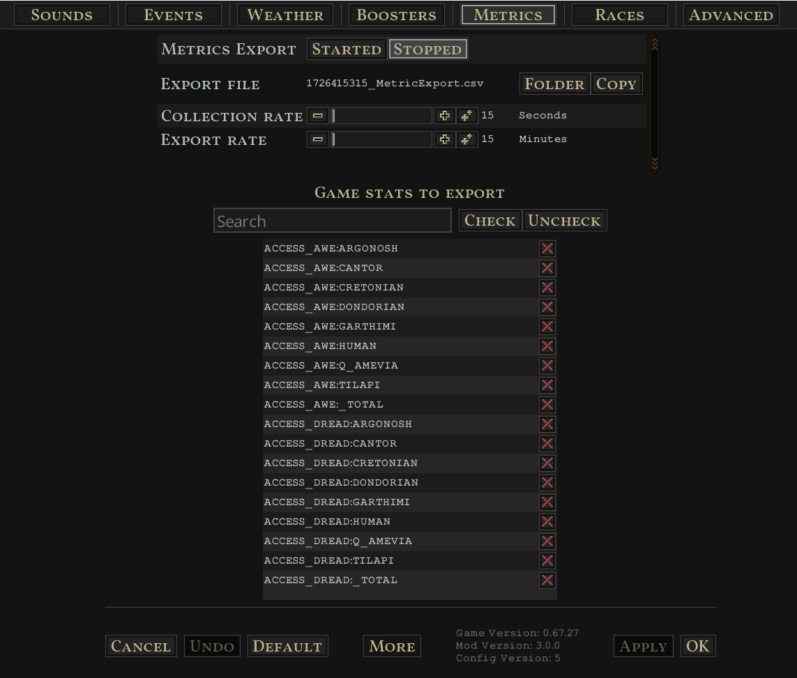
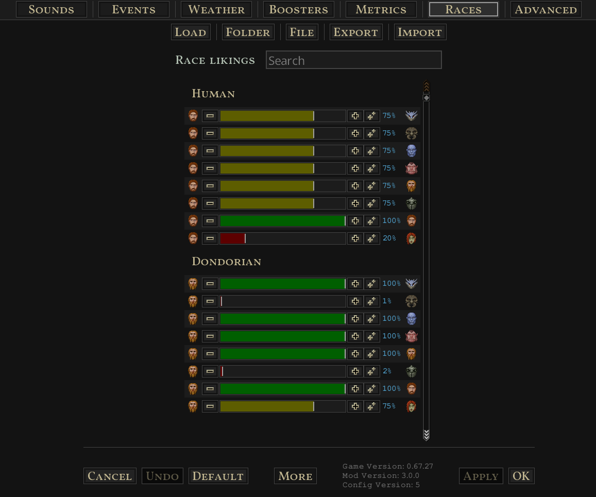
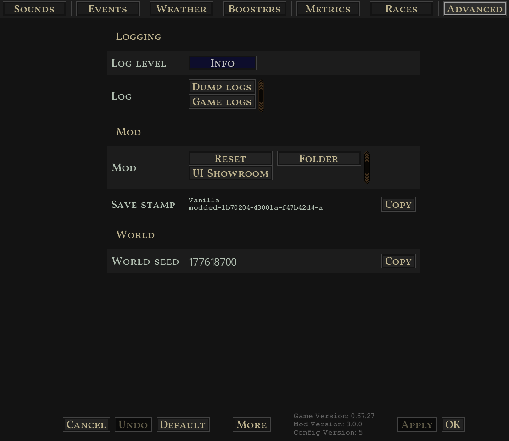

Updated for **V65** by [Senso](https://github.com/SensoHakai).

Adds a menu with more options for the game:

* Tune the volume of in game sounds like wind
* Toggle certain random events
* Tune the amount of weather effects like snow
* Influence bonuses
* Collect and export game stats into a CSV file
* Change the likings between your races
* Game crash detection and backup mechanism











# Getting started

[Maven](https://maven.apache.org/) is required to compile, package and install the mod.

**(1)** Install games jar file as dependency by copying it from the game installation folder
```
mvn validate 
```

(i) You only have `validate` once (or when the games got an update you need)

**(2)** Compile mod source; prepare mod file structure; copy mod files to game mod directory
```
mvn install 
```


**(!)** Game installation and mod directory paths are configured in the `pom.xml` in the `<profiles>` and are default set to:

**Game Installation**
* **Windows:** C:\Program Files (x86)\Steam\steamapps\common\Songs of Syx
* **Linux:** ~/.steam/steam/SteamApps/common/Songs of Syx

**Mod Directory**
* **Windows:** ${user.home}/AppData/Roaming/songsofsyx/mods/
* **Linux:** ~/.local/share/songsofsyx/mods/


**(3)** Run the game, and you should see a `Example Mod` mod. Activate it and launch.

# Build commands

**(i)** Installs only the games `SongsOfSyx.jar` and `info/SongsOfSyx-sources.jar` as a dependency, and validate whether it was successful.
```
mvn validate
```

**(!)** This is required or the project won't find the games code.

**(i)** Building the mod only into `target/out`:
```
mvn package
```

The source code of the mod will be copied into e.g. `target/out/songs-of-syx-mod-example/V63/script/_src`.

**(i)** Build and copy the output into the games mods folder (excluding `_src`):
```
mvn install
```

**(!)** The games mod folder location varies on each OS. There are maven profiles "windows" and "linux". The "windows" profile is the default.
Maven should detect when you are building on a Linux OS and switch to the "linux" profile (not tested).
You can force a profile with e.g.

```
mvn install -P linux
```

**(i)** Deletes the `target` directory containing the packaged mod files and removes the mod from the games mod directory.
```
mvn clean
```

# Mod Info / Build Settings

In the `pom.xml` you will find `<properties>` where you can change information about the mod.
There you can also change the `<game.version.major>` property to your used game version. 
The `<game.version.minor>` property is only important when your mod really depends on stuff in this version and isn't compatible with lower versions.

Files (e.g. assets) for the mod are located in `src/main/java/resources/mod-files` and will be copied in the `package` phase.

# Debugging

You can enable **Debug Mode** and **Developer Mode** in the game launcher **settings**. 
You will get more detailed logs and in-game developer tools for testing.

## Intellij IDEA

There are two `.xml`files in the `.run/` folder:

* `Main.run.xml` launches the game directly
* `MainLaunchLauncher.run.xml` starts the game launcher

You may want to edit the `WORKING_DIRECTORY` option to your local game installation path.
It's default set to: `C:/Program Files (x86)/Steam/steamapps/common/Songs of Syx`.

And your package name may also differ in the `PATTERN` option.
It's default set to: `jake.example.*`

They should be automatically available [in the IDE](https://www.jetbrains.com/help/idea/run-debug-configuration.html). 
You can also edit them there :)


